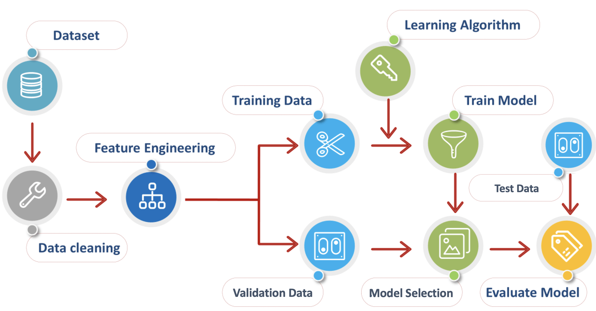

# 人工智能导论第二次作业-分类实践

### 介绍

我们在课上介绍了多种分类算法，如逻辑回归，决策树，支持向量机等。本次作业旨在让大家掌握使用机器学习进行数据挖掘的的技术栈，能够自主实现一些基础的机器学习算法，运用自己所学解决实际问题。

### 数据集

世界卫生组织(WHO)于2020年3月11日将由SARS-CoV-2引起的COVID-19定性为全球性流行病。应对大流行病不仅需要公共卫生机构的努力，更需要各个国家政府、相关机构与众多社会人士的通力协作。作为MLer，我们可以借助疑似病例中是否确诊的样本，通过训练机器学习模型来辅助新冠病例的诊断。

本次作业使用的[数据集](./data/dataset.xlsx)包含来自巴西圣保罗Israelita Albert Einstein医院的患者的匿名数据，每条数据包含了患者的血细胞比容(Hematocrit)，血红蛋白含量(Hemoglobin)与平均血小板体积(Mean platelet volume)等特征，以预测SARS-CoV-2病毒的检验结果(Negative/Positive)，所有特征均已提前进行过归一化。


### 流程概述

一般来说，使用机器学习模型进行数据挖掘的流程示意如下。借助此图，可将这次实践大致划分为四个部分：



#### 数据处理

在这一步中，我们需要读取并处理数据。例如：
* 将离散型/类别特征转化为连续特征
* 针对含有缺失值的数据，选择舍弃或使用某些方法填充
* 进行特征工程：例如选择重要的特征或特征组合

#### 模型实现

课上我们已经学习了诸多分类模型，不同模型基于的假设不同，在同一数据上的表现也不同。我们鼓励大家：
* 借助成熟的工具库，了解实际应用中常会出现的模型，尝试它们的效果
* 能够模仿这些模型的接口，自己实现一些简单的模型

#### 模型选择

我们在训练数据上训练模型的最终目标是为了提高在训练时未见过的测试数据上的效果。为此，我们需要选择合适的模型并设置一组好的超参数，进行选择的方法如：
* 交叉验证：将训练数据按比例划分为训练集和交叉验证集，使用训练集对训练模型，在交叉验证集上测试模型的效果，最终选择在交叉验证集上分类准确率最高的模型

#### 测试评估

在测试数据上进行模型评估，评估标准包括但不限于：
* 分类准确率
* 混淆矩阵
* AUC/ROC曲线

### 作业要求

### 评分 (60 Points)

* 代码 (40 Points)
  * 我们给大家提供了大部分代码框架，运行前需要安装必要的库，命令为 ```pip install -r requirements.txt```，请仔细阅读```playground.ipynb```，根据要求实现相关代码或汇报实验结果（已标注**TODO**）
  * 以Python代码或Jupyter Notebook的形式提交，要求代码逻辑清晰，注释清楚，可读性较好
* 文档 (20 Points)
  * 详见**TODO**说明中的**requirements**

如果大家在项目中遇到任何问题，欢迎在课程微信群中讨论 。


### 参考教程

* Jupyter Notebook教程：https://zhuanlan.zhihu.com/p/75402607
* numpy矩阵运算：https://www.numpy.org.cn/reference/
* pandas数据处理：https://pandas.pydata.org/docs/getting_started/intro_tutorials/
* scikit-learn库：https://scikit-learn.org/stable/index.html

